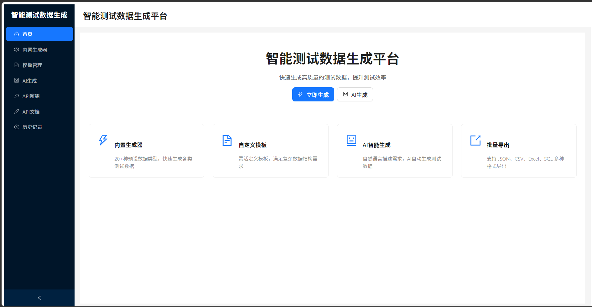
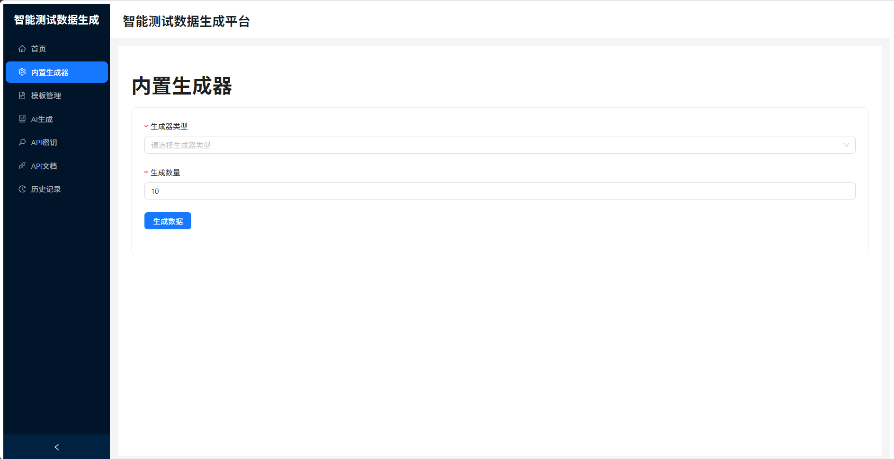
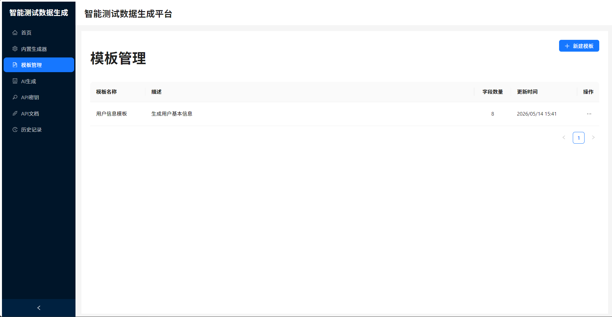
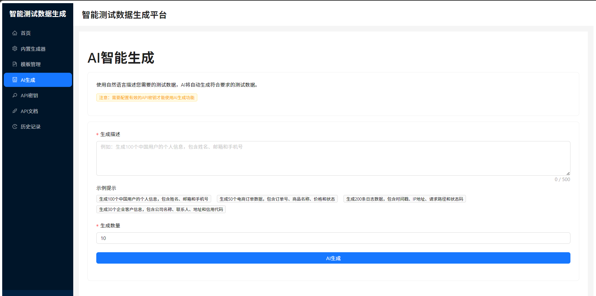
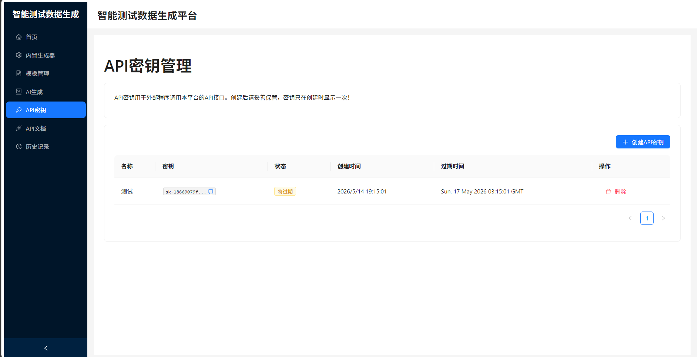
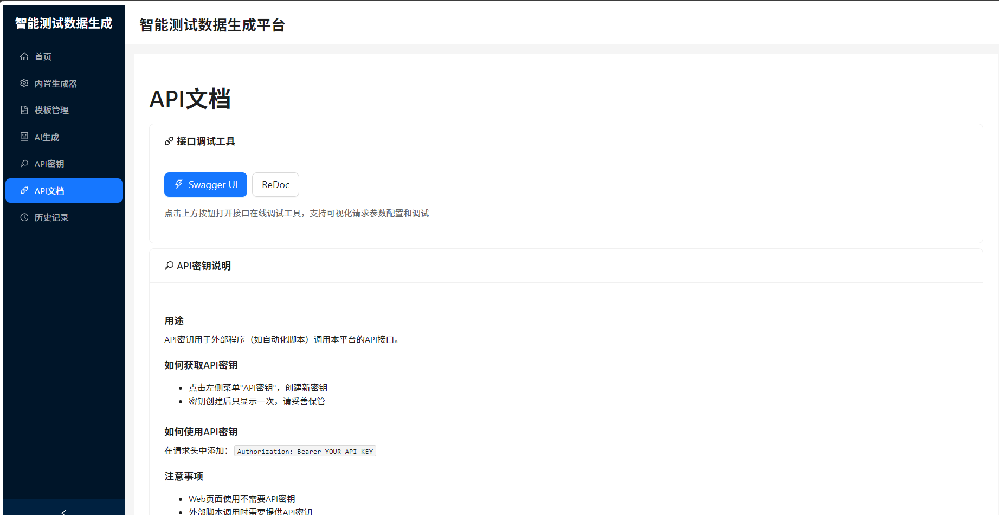
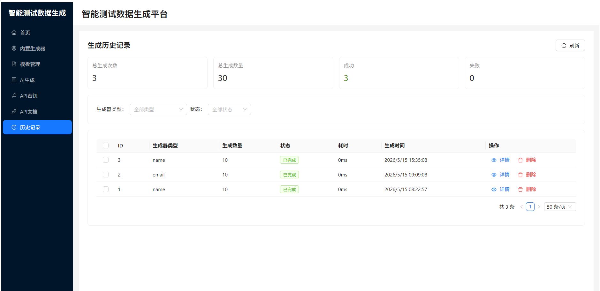

# 智能测试数据生成平台

一个基于AI的智能测试数据生成平台，支持多种数据类型生成、模板管理和AI辅助生成，帮助开发者和测试工程师快速生成高质量的测试数据。

---

## 📸 功能预览

### 🏠 首页


### ⚙️ 内置生成器


### 📋 模板管理


### 🤖 AI智能生成


### 🔑 API密钥管理


### 📚 API文档


### 📜 历史记录


---

## 技术栈

### 后端
- Python 3.13
- FastAPI 0.116.1
- SQLAlchemy 2.0
- SQLite

### 前端
- React 18
- TypeScript
- Ant Design 5
- Axios
- Vite

---

## 项目结构

```
ai-test-data-generator/
├── backend/
│   ├── app/
│   │   ├── api/              # API路由层
│   │   │   ├── ai.py         # AI生成接口
│   │   │   ├── api_key.py    # API密钥管理接口
│   │   │   ├── generator.py  # 数据生成接口
│   │   │   ├── history.py    # 历史记录与批量删除接口
│   │   │   ├── router.py     # 路由注册
│   │   │   └── template.py   # 模板管理接口
│   │   ├── models/           # 数据库ORM模型
│   │   ├── schemas/          # Pydantic请求/响应模型
│   │   ├── services/         # 业务逻辑层
│   │   ├── utils/
│   │   │   ├── data_generators/  # 数据生成器模块
│   │   │   └── llm_client.py     # LLM客户端
│   │   ├── main.py           # FastAPI应用入口
│   │   ├── config.py         # 配置管理
│   │   └── database.py       # 数据库配置
│   └── requirements.txt      # Python依赖
├── frontend/
│   ├── src/
│   │   ├── components/       # React组件
│   │   ├── pages/            # 页面组件
│   │   ├── services/         # API服务
│   │   └── types/            # TypeScript类型定义
│   ├── package.json
│   └── vite.config.ts
├── screenshots/              # 项目截图
└── .env.example              # 环境变量示例
```

---

## 快速开始

### 前置要求

- Python 3.13+
- Node.js 18+

### 后端配置

1. 进入后端目录：
   ```bash
   cd backend
   ```

2. 安装Python依赖：
   ```bash
   pip install -r requirements.txt
   ```

3. 复制环境变量配置文件：
   ```bash
   cp .env.example .env
   ```

4. 编辑`.env`文件，配置API密钥：
   ```
   QWEN_API_KEY=your_qwen_api_key_here
   QWEN_BASE_URL=https://dashscope.aliyuncs.com/compatible-mode/v1
   DATABASE_URL=sqlite:///./test_data_generator.db
   ```

5. 启动后端服务：
   ```bash
   uvicorn app.main:app --host 0.0.0.0 --port 8000 --reload
   ```

   或者使用启动脚本：
   ```bash
   # Windows
   start.bat
   
   # Linux/Mac
   ./start.sh
   ```

### 前端配置

1. 进入前端目录：
   ```bash
   cd frontend
   ```

2. 安装依赖：
   ```bash
   npm install
   ```

3. 启动开发服务器：
   ```bash
   npm run dev
   ```

### 访问应用

- 前端界面：http://localhost:5174
- 后端API文档：http://localhost:8000/docs
- OpenAPI规范：http://localhost:8000/redoc

---

## 配置说明

所有配置通过环境变量管理，可在`.env`文件中设置：

| 变量名 | 说明 | 默认值 | 是否必填 |
|--------|------|--------|----------|
| QWEN_API_KEY | 通义千问API密钥 | - | 是 |
| QWEN_BASE_URL | API基础URL | https://dashscope.aliyuncs.com/compatible-mode/v1 | 否 |
| DATABASE_URL | 数据库连接字符串 | sqlite:///./test_data_generator.db | 否 |

---

## 内置数据生成器

平台内置20+种数据生成器，覆盖多种测试场景：

### 个人信息
| 生成器类型 | 说明 |
|-----------|------|
| name | 姓名 |
| id_card | 身份证号 |
| phone | 手机号 |
| email | 邮箱 |
| gender | 性别 |
| age | 年龄 |
| birth_date | 出生日期 |

### 地址信息
| 生成器类型 | 说明 |
|-----------|------|
| province | 省份 |
| city | 城市 |
| district | 区县 |
| address | 详细地址 |
| postcode | 邮编 |
| latitude | 纬度 |
| longitude | 经度 |
| full_address | 完整地址 |

### 金融信息
| 生成器类型 | 说明 |
|-----------|------|
| bank_card | 银行卡号 |
| credit_card | 信用卡号 |
| bank_name | 银行名称 |
| amount | 金额 |

### 企业信息
| 生成器类型 | 说明 |
|-----------|------|
| company_name | 公司名称 |
| credit_code | 统一社会信用代码 |
| industry | 行业 |
| company_phone | 公司电话 |
| company_address | 公司地址 |

### 产品信息
| 生成器类型 | 说明 |
|-----------|------|
| product_name | 产品名称 |
| sku | SKU编码 |
| price | 价格 |
| stock | 库存 |
| category | 分类 |

### 其他类型
| 生成器类型 | 说明 |
|-----------|------|
| uuid | UUID |
| ip | IP地址 |
| mac | MAC地址 |
| url | URL链接 |
| timestamp | 时间戳 |
| random_string | 随机字符串 |

---

## API文档

启动后端服务后，可通过以下地址访问交互式API文档：

- Swagger UI：http://localhost:8000/docs
- ReDoc：http://localhost:8000/redoc

### 主要API端点：
- `POST /api/generate` - 生成测试数据
- `POST /api/ai/generate` - AI辅助生成
- `GET /api/generators` - 获取支持的生成器列表
- `GET /api/templates` - 获取模板列表
- `POST /api/templates` - 创建模板
- `GET /api/history` - 获取历史记录列表
- `GET /api/history/{id}` - 获取单个历史记录详情
- `DELETE /api/history/{id}` - 删除单个历史记录
- `POST /api/history/batch-delete` - 批量删除历史记录
- `GET /api/history/stats` - 获取历史记录统计

---

## 使用示例

### Python调用示例

```python
import requests
import json

# 生成测试数据
response = requests.post(
    "http://localhost:8000/api/generate",
    json={
        "count": 10,
        "fields": [
            {"name": "姓名", "type": "name"},
            {"name": "手机号", "type": "phone"},
            {"name": "邮箱", "type": "email"}
        ]
    }
)

data = response.json()
print(json.dumps(data, indent=2, ensure_ascii=False))
```

### JavaScript调用示例

```javascript
// 生成测试数据
const response = await fetch("http://localhost:8000/api/generate", {
  method: "POST",
  headers: {
    "Content-Type": "application/json",
  },
  body: JSON.stringify({
    count: 10,
    fields: [
      { name: "姓名", "type": "name" },
      { name: "手机号", "type": "phone" },
      { name: "邮箱", "type": "email" },
    ],
  }),
});

const data = await response.json();
console.log(data);
```

### AI生成提示词示例

在平台中使用AI生成功能时，可以输入自然语言描述需求：

```
生成10条测试用户数据，包含姓名、身份证号、手机号和邮箱，
要求手机号以138开头，邮箱使用163邮箱。
```

---

## 主要功能

- **多种数据生成器**：内置20+种数据生成器，覆盖个人信息、地址、金融、企业、产品等场景
- **AI辅助生成**：支持通过自然语言描述生成定制化测试数据
  - 支持自定义API密钥和模型选择（Qwen Plus/Turbo/Max）
  - API密钥安全存储在浏览器本地，不上传服务器
  - 实时生成进度显示
  - 智能错误提示和处理
  - 分批次生成，支持最多100条数据
- **模板管理**：可创建、保存和复用数据生成模板
- **数据导出**：支持导出为JSON、CSV、Excel和SQL格式
- **API密钥管理**：支持API密钥的创建和管理
- **历史记录管理**：完整记录所有生成任务，支持查看、筛选和搜索历史记录
  - 支持AI生成类型筛选
  - 历史记录详情页显示AI提示词
- **批量删除**：支持多选并批量删除历史记录，高效清理无用数据
- **可视化界面**：提供友好的Web界面，方便操作和管理

---

## UI自动化测试

### 快速开始

1. 进入测试目录：
```bash
cd ui_tests
```

2. 查看所有可用的测试模块：
```bash
python run_tests.py -l
```

3. 运行所有测试：
```bash
python run_tests.py
```

4. 运行特定模块测试：
```bash
python run_tests.py -m test_generator
```

### 查看测试报告

#### 在线报告（实时查看）
```bash
python generate_online_report.py
```

#### 离线报告（静态HTML）
```bash
python generate_offline_report.py
```

### 更多信息

详细的测试文档请参考 [ui_tests/README.md](ui_tests/README.md) 和 [ui_tests/QUICKSTART.md](ui_tests/QUICKSTART.md)

---

## 许可证

本项目仅供学习和内部使用。
